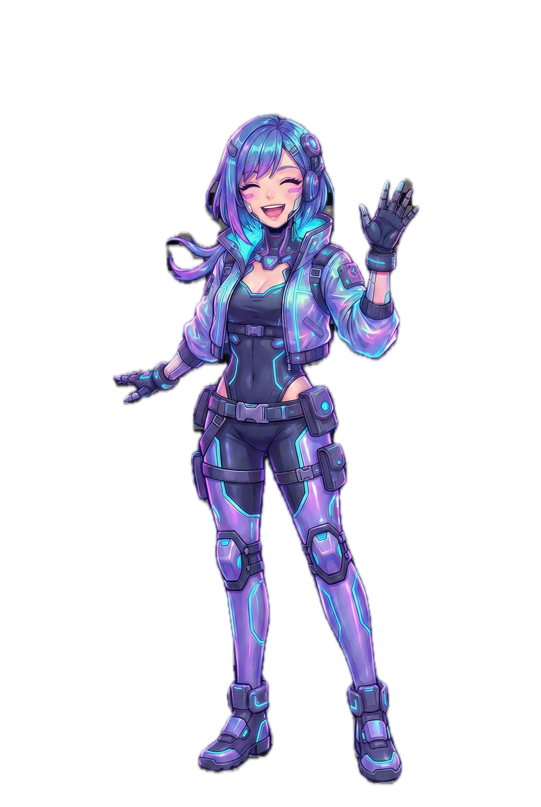

# Claude FX Plugin

Animated mascot companion for Claude Code. A transparent overlay that floats beside your terminal and reacts to Claude's activity in real-time.

https://github.com/user-attachments/assets/587f0788-55ef-4d38-8987-dd6c4b273fbe



## Features

- **Immersive Animations** - Breathing, swaying, cursor tracking - your character feels alive
- **Speech Bubbles** - Customizable styled messages that react to each state
- **Emotion Overlays** - Sparkles, sweat drops, zzz bubbles drawn on ANY PNG
- **State Transitions** - Bounce, shake, and pop animations on state changes
- **8 Character States** - idle, greeting, working, success, error, celebrating, sleeping, farewell
- **Floating Animation** - Subtle bobbing motion with glowing aura effect
- **Sound Effects** - Audio feedback for each state
- **Multi-Instance Support** - Multiple terminals simultaneously
- **Smart Visibility** - Only shows when its terminal is focused

## Installation

**Inside Claude Code, run:**

```
/plugin marketplace add octaviusp/claude-fx-plugin
/plugin install claude-fx-plugin@claude-fx-marketplace
```

Run `/claude-fx:setup` to check dependencies.

> **Note:** Due to [issue #10997](https://github.com/anthropics/claude-code/issues/10997), you may need to reload your session and say "hello" for the overlay to appear.

### Alternative: Manual Install

```bash
git clone https://github.com/octaviusp/claude-fx-plugin
claude --plugin-dir ./claude-fx-plugin
```

## Configuration

Edit `settings-fx.json` in the plugin folder:

```json
{
  "overlay": {
    "enabled": true,
    "responsive": true,
    "heightRatio": 1,
    "maxHeight": 750,
    "offsetX": 20,
    "offsetY": 0,
    "showOnlyWhenTerminalActive": true,
    "fadeAnimation": true,
    "bottomGradient": {
      "enabled": true,
      "percentage": 0.8
    }
  },
  "audio": {
    "enabled": true,
    "volume": 0.5
  },
  "theme": "default",
  "immersion": {
    "breathing": true,
    "sway": true,
    "cursorInfluence": true,
    "cursorInfluenceStrength": 0.5,
    "transitions": true
  },
  "speechBubble": {
    "enabled": true,
    "backgroundColor": "#1a1a2e",
    "borderColor": "#4a9eff",
    "borderRadius": 8,
    "fontFamily": "SF Mono",
    "fontSize": 13,
    "fontColor": "#ffffff",
    "displayDuration": 3.0
  },
  "emotionOverlays": {
    "enabled": true
  }
}
```

### Settings Reference

#### Overlay
| Setting | Description | Default |
|---------|-------------|---------|
| `overlay.enabled` | Show/hide the overlay | `true` |
| `overlay.responsive` | Scale with terminal height | `true` |
| `overlay.heightRatio` | Ratio of terminal height (0.0-1.0) | `1` |
| `overlay.maxHeight` | Maximum height in pixels | `750` |
| `overlay.customX/Y` | Fixed position coordinates | `null` |
| `overlay.offsetX/Y` | Offset from terminal edge | `20`/`0` |
| `overlay.bottomGradient.percentage` | Portion to fade (0.0-1.0) | `0.8` |

#### Immersion
| Setting | Description | Default |
|---------|-------------|---------|
| `immersion.breathing` | Subtle scale pulse animation | `true` |
| `immersion.sway` | Gentle rotation and drift | `true` |
| `immersion.cursorInfluence` | Character tilts toward cursor | `true` |
| `immersion.cursorInfluenceStrength` | Tilt intensity (0.0-1.0) | `0.5` |
| `immersion.transitions` | State change animations | `true` |

#### Speech Bubble
| Setting | Description | Default |
|---------|-------------|---------|
| `speechBubble.enabled` | Show speech bubbles | `true` |
| `speechBubble.backgroundColor` | Bubble background (hex) | `#1a1a2e` |
| `speechBubble.borderColor` | Bubble border (hex) | `#4a9eff` |
| `speechBubble.borderRadius` | Corner radius in pixels | `8` |
| `speechBubble.fontFamily` | Font family name | `SF Mono` |
| `speechBubble.fontSize` | Font size in points | `13` |
| `speechBubble.fontColor` | Text color (hex) | `#ffffff` |
| `speechBubble.displayDuration` | Seconds to show bubble | `3.0` |

#### Emotion Overlays
| Setting | Description | Default |
|---------|-------------|---------|
| `emotionOverlays.enabled` | Show emotion effects | `true` |

## Customization

### Custom Characters

Drop PNG files in `themes/default/characters/`:

```
idle.png        # Default state
greeting.png    # Session start
working.png     # Tool execution
success.png     # Task completed
error.png       # Something failed
celebrating.png # Response finished
sleeping.png    # Extended idle
```

**Requirements:** PNG with transparent background (any size, auto-scaled)

**No special assets needed** - all immersion effects (breathing, sway, emotions) work on ANY static PNG!

### Custom Messages

Edit `messages.json` to customize speech bubble text:

```json
{
  "greeting": ["Ready!", "Let's go!", "Hello!"],
  "working": ["On it...", "Processing..."],
  "success": ["Done!", "Got it!"],
  "error": ["Hmm...", "Let me check."],
  "celebrating": ["Nice!", "Victory!"],
  "sleeping": ["Zzz...", "*yawn*"],
  "farewell": ["Bye!", "See you!"],
  "idle": ["Need anything?", "I'm here."]
}
```

### Custom Sounds

Drop audio files in `themes/default/sounds/`:

```
greeting.aiff    # Session start
working.aiff     # Tool execution
success.aiff     # Task completed
error.aiff       # Something failed
celebrating.aiff # Response finished
farewell.aiff    # Session end
```

**Supported formats:** `.wav`, `.mp3`, `.aiff`, `.m4a`, `.caf`, `.aac`

## Commands

| Command | Description |
|---------|-------------|
| `/claude-fx:setup` | Check and install dependencies |
| `/claude-fx:change-fx` | Guide to customize characters and sounds |
| `/claude-fx:change-character` | Switch character folder (session-only) |
| `/claude-fx:clean-fx` | Emergency cleanup (kill stuck overlays) |

## Immersion Effects

The plugin adds life to ANY static PNG:

| Effect | Description |
|--------|-------------|
| **Breathing** | Subtle Y-axis scale pulse (character appears to breathe) |
| **Sway** | Gentle rotation and horizontal drift |
| **Cursor Tracking** | Character tilts toward your mouse cursor |
| **Bounce** | Success/celebrating states bounce up |
| **Shake** | Error state shakes horizontally |
| **Scale Pop** | Greeting/working states pop larger briefly |

### Emotion Overlays

Programmatically drawn effects (no extra assets needed):

| State | Effect |
|-------|--------|
| error | Animated sweat drop |
| success | Pulsing sparkles |
| celebrating | Sparkles + rotating star |
| sleeping | Floating Zzz bubbles |
| working | Radiating focus lines |

## Requirements

**macOS only** - Uses PyObjC for native transparent windows

Dependencies (auto-checked on startup):
- Python 3.9+
- Pillow (image processing)
- pyobjc-framework-Cocoa (native UI)
- pyobjc-framework-Quartz (window detection)

Manual check:
```bash
python3 scripts/setup.py --force
```

## Troubleshooting

| Problem | Solution |
|---------|----------|
| Overlay not showing | Run `/claude-fx:setup` to check dependencies |
| Wrong position | Set `customX`/`customY` in settings |
| No sound | Check `audio.enabled: true` and `audio.volume > 0` |
| Overlay stuck | Run `/claude-fx:clean-fx` to force cleanup |
| Too much movement | Disable `immersion.sway` or reduce `cursorInfluenceStrength` |
| No speech bubbles | Check `speechBubble.enabled: true` |
| Text hard to read | Increase `bottomGradient.percentage` (e.g., `0.9`) |

## Project Structure

```
claude-fx-plugin/
├── .claude-plugin/
│   └── plugin.json       # Plugin manifest
├── hooks/
│   └── hooks.json        # Hook event mappings
├── scripts/
│   ├── hook-handler.py   # Processes hooks, plays sounds
│   ├── overlay.py        # PyObjC transparent overlay
│   └── setup.py          # Dependency checker
├── themes/default/
│   ├── characters/       # PNG images per state
│   ├── sounds/           # Audio files
│   └── manifest.json     # State → asset mappings
├── commands/             # Slash command documentation
├── settings-fx.json      # User configuration
├── messages.json         # Speech bubble messages
└── README.md
```

## Platform Support

| Platform | Status |
|----------|--------|
| macOS | Full support |
| Linux | Not supported (coming soon) |
| Windows | Not supported |

## What's New in v2.0

- **Immersion System** - Breathing, sway, cursor tracking animations
- **Speech Bubbles** - Styled message boxes with customizable appearance
- **Emotion Overlays** - Programmatic sparkles, sweat drops, zzz effects
- **State Transitions** - Bounce, shake, and pop animations
- **Messages File** - Customizable speech bubble text via `messages.json`

## License

MIT - See [LICENSE](LICENSE) for details.

## Author

[Octavio](https://github.com/octaviusp)
